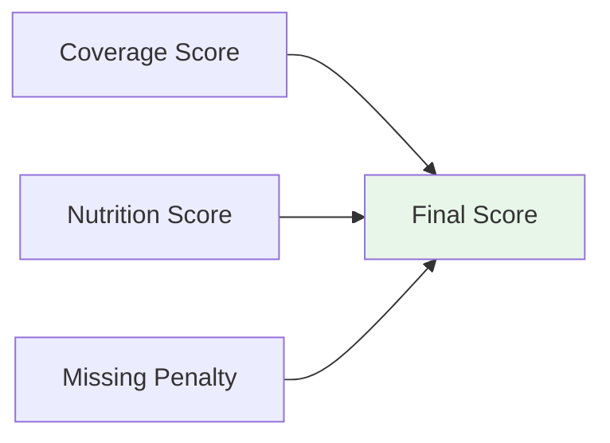
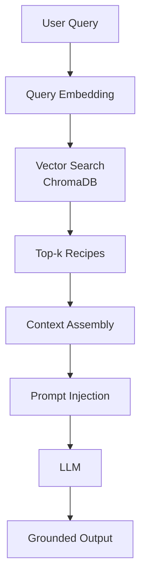
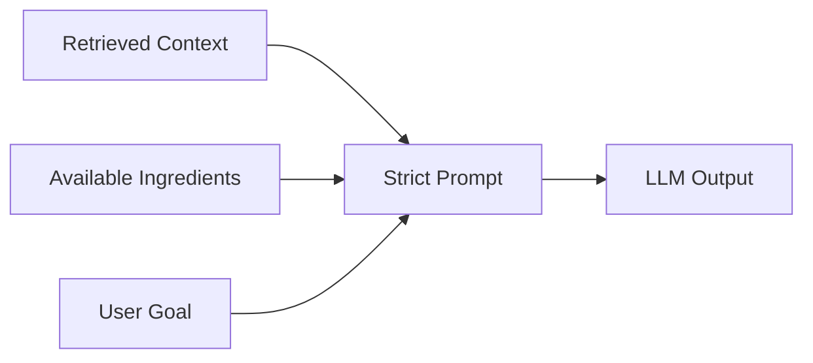

# 🍽 **NutriChefAI – Intelligent Ingredient-Based Meal Recommendation System**

## *A Hybrid Data Science + Retrieval-Augmented Generative AI Architecture*

---

## 📋 Table of Contents

1. [Overview](#-overview)
2. [Core Idea](#-core-idea-very-important)
3. [System Architecture](#-system-architecture-actual-implementation)
4. [Ingredient-Constrained Logic](#-ingredient-constrained-logic)
5. [Mathematical Scoring Framework](#-mathematical-scoring-framework)
6. [Reinforcement Learning Feedback Loop](#reinforcement-learning-feedback-loop)
7. [Retrieval-Augmented Generation (RAG)](#-retrieval-augmented-generation-rag)
8. [Prompt Control Strategy](#-prompt-control-strategy)
9. [Technology Stack](#-technology-stack)
10. [Key Advantages](#-key-advantages)
11. [Limitations](#-limitations)
12. [Future Scope](#-future-scope)
13. [Conclusion](#-conclusion)

---

## 🌟 Overview

**NutriChefAI** is an intelligent recipe recommendation and generation system that produces **feasible, nutrition-aware recipes strictly based on ingredients available with the user**.

Unlike traditional recipe platforms or pure LLM-based systems, NutriChefAI **prevents hallucination**, **enforces ingredient feasibility**, **grounds all generation in verified data** using a hybrid AI architecture, and **improves over time using reinforcement learning**.

---

## 🎯 Core Idea (Very Important)

> **Ingredients are decided by data science logic, not by the language model.**

The LLM is used **only to explain and format recipes**, never to invent ingredients or nutritional values.

---

## 🏗 System Architecture (Actual Implementation)

```mermaid
graph TB
    U[User Input<br/>Ingredients + Goal] --> N[Ingredient Normalizer]
    N --> M[Ingredient Matching Engine]
    M --> F[Feasible Recipe Filter]

    F --> S[Scoring Engine]
    S --> R[Ranked Recipes]

    R --> V[Vector Retrieval<br/>ChromaDB]
    V --> C[RAG Context Builder]
    C --> L[LLM Generation<br/>(Constrained)]

    L --> O[Final Recipe Output]
    O --> FB[User Feedback]
    FB --> RL[Reinforcement Learning Agent]
    RL --> UP[Update Scoring Weights]
    UP --> S
    
    subgraph Data_Layer
        D1[(MySQL Database)]
        D2[(ChromaDB Vector Store)]
    end

    M --> D1
    S --> D1
    V --> D2
```

### Architecture Principles
* Deterministic filtering before AI
* Retrieval before generation
* Strict prompt constraints
* Modular, testable layers
* Continuous improvement via RL

---

## 🧮 Ingredient-Constrained Logic

Ingredient feasibility is enforced using **set theory**.

Let:
* **U** = User-available ingredients
* **R** = Recipe-required ingredients

```text
Matched Ingredients:   M = U ∩ R
Missing Ingredients:   X = R − U
Coverage Score:        |M| / |R|
```

Recipes with insufficient coverage are **discarded before reaching the AI layer**.

---

## 📊 Mathematical Scoring Framework



### Final Ranking Formula
```
FinalScore = w₁ × Coverage + w₂ × HealthScore + w₃ × Penalty
```
*(w₁, w₂, w₃ are dynamically adjusted via RL)*

This ensures:
* Ingredient feasibility is prioritized
* Nutrition goals are respected
* Recipes remain practical

---

## 🤖 Reinforcement Learning Feedback Loop

```mermaid
graph TD
    U[User Receives Recipe] --> F[Provides Feedback<br/>(Rating/Engagement)]
    F --> R[RL Agent]
    R --> A[Analyzes Action-Outcome]
    A --> U[Updates Policy]
    U --> O[Optimizes Future Recommendations]
```

### RL Implementation
* **State**: User profile + available ingredients + nutritional goal
* **Action**: Recipe recommendation
* **Reward**: User rating (1-5 stars) + engagement metrics
* **Policy**: Continuously optimized weights in scoring formula

### Learning Process
```
Updated_Weight = Current_Weight + α × (Reward - Expected_Reward) × Feature_Value
```
Where α = learning rate

---

## 🥗 Nutrition-Aware Scoring

### Weight Loss
```
Health = 2P - 0.5H - F - 0.01C
```

### Muscle Gain
```
Health = 3P + 0.5H - 0.2F
```

### Balanced Diet
```
Health = 2P + H - F
```

Where:
* **P** = Protein
* **H** = Fiber
* **F** = Fat
* **C** = Calories

*(Formula coefficients can be optimized via RL)*

---

## 🔍 Retrieval-Augmented Generation (RAG)



### Why RAG?
* Prevents hallucination
* Ensures factual correctness
* Keeps LLM grounded in real recipes

---

## ✍️ Prompt Control Strategy



### Prompt Guarantees
* ❌ No new ingredients
* ❌ No guessed nutrition
* ✅ Explicit missing ingredients
* ✅ Structured output

---

## 🛠 Technology Stack

### Backend
* Python
* Flask
* SQLAlchemy
* MySQL

### AI & Data Science
* NumPy
* Pandas
* Scikit-learn
* OpenAI Embeddings
* ChromaDB
* Reinforcement Learning (Custom/RLlib)

### Frontend
* HTML
* CSS


---

## ✅ Key Advantages
* Ingredient-feasible recipes
* Hallucination-free generation
* Explainable scoring logic
* Health-goal personalization
* Clean, modular architecture
* **Continuous self-improvement via RL**
* Interview & production ready

---

## ⚠ Limitations
* Relies on quality of ingredient data
* Embedding API cost
* Rule-based nutrition formulas (initially)
* Requires user feedback for RL optimization

---

## 🔮 Future Scope
* Smart refrigerator integration
* Expiry-aware ingredient ranking
* Weekly meal planning
* **Advanced multi-agent RL systems**

---

## 🏁 Conclusion

NutriChefAI demonstrates how **classical data science and modern generative AI can be responsibly combined**. By enforcing ingredient constraints, grounding generation using retrieval, and **adapting through reinforcement learning feedback**, the system delivers practical, accurate, and continuously improving recipe recommendations.

---